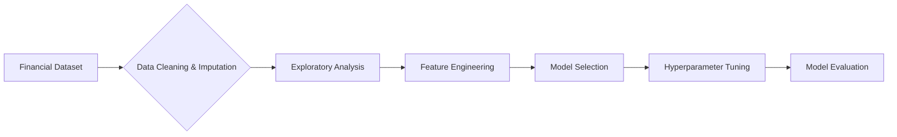

# 💰 Loan Eligibility Prediction
**Machine Learning Models for Automated Credit Decisioning**

## 🛠️ Methodology & Technical Challenges

### 1️⃣ Data Preparation & Cleaning
- **Challenge**: Dataset contained 149 missing values across features (Credit_History: 50, Self_Employed: 32, LoanAmount: 22, Dependents: 15)
- **Solution**: Implemented KNN imputation (n_neighbors=5) with separate processing for numeric and categorical features 
- **Result**: Recovered complete dataset while maintaining statistical distributions and relationships

### 2️⃣ Exploratory Data Analysis
- **Finding**: Applicant demographics showed 80% male, 65% married, 15% self-employed, with 85% having good credit history
- **Insight**: Credit history showed strongest correlation with loan approval (visible in correlation heatmap)
- **Visualization**: Created demographic distribution charts and analyzed loan approval rates by category

### 3️⃣ Feature Engineering
- **Challenge**: Needed to capture financial relationships beyond raw data
- **Approach**: Created derived financial ratios and transformations:
 - Income_Loan_Ratio = ApplicantIncome / (LoanAmount + 1)
 - Total_Income = ApplicantIncome + CoapplicantIncome
 - Log_Total_Income = np.log1p(Total_Income)
- **Feature Selection**: Used RandomForestClassifier with SelectFromModel to identify most predictive features

### 4️⃣ Model Training & Optimization
- **Challenge**: Class imbalance and model selection uncertainty
- **Solution**: Applied SMOTE resampling technique and implemented comprehensive model evaluation
- **Optimization**: Performed GridSearchCV with 5-fold cross-validation for each model:
 - Logistic Regression with Bagging: 80.85% accuracy
 - Decision Tree with optimized depth: 78.2% accuracy 
 - Random Forest (n_estimators=800): 81.47% accuracy
 - XGBoost with tuned parameters: 84.5% accuracy

